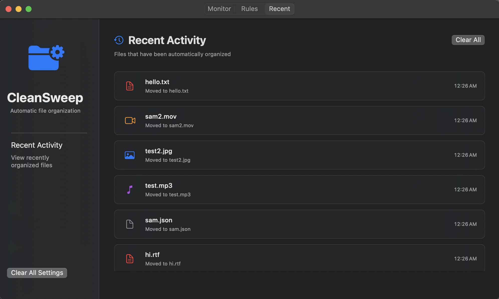

# CleanSweep

**Automatic file organization for your Mac's Downloads folder**

CleanSweep is a lightweight macOS utility that automatically organizes your folder by moving files into categorized subfolders based on their file type.
                                    
## Screenshots

## Features
- Monitors your folder in real-time
- Instantly moves new files to appropriate subfolders
- Prevents duplicate file conflicts with automatic renaming
- Pre-configured folders for common file types if you want to use the defaults
- Easy to add your own rules for extensions and folder names

## Installation

### Download & Setup

1. Download the latest release ZIP file from the [releases page](../../releases)
2. Extract the ZIP file to reveal the CleanSweep app
3. Move CleanSweep.app to your Applications folder
4. Right-click on CleanSweep and select "Open"
5. Click "Open" when macOS asks about running an app from an unidentified developer

> **Important Security Note**
> Since this app is signed with a personal developer certificate rather than distributed through the Mac App Store, macOS will initially block it. This is normal behavior for apps distributed outside the App Store. The right-click and "Open" method bypasses this security warning safely.

### Auto-Start Setup
To set CleanSweep to automatically start at login, follow these steps:
1. Open system settings
2. Inside of General go to Login Items and Extensions
3. Click the plus and choose CleanSweep

## Default Rules
By default, CleanSweep watches your Downloads folder and automatically organizes files into the following categories:

| Category | File Types | Destination |
|----------|------------|-------------|
| **Music** | MP3, FLAC, M4A, WAV, AAC | `Downloads/music` |
| **Images** | JPG, PNG, GIF, BMP, TIFF | `Downloads/images` |
| **Documents** | PDF, DOC, DOCX, TXT, RTF | `Downloads/documents` |
| **Videos** | MP4, AVI, MKV, MOV, WMV | `Downloads/videos` |
| **Archives** | ZIP, RAR, 7Z, TAR, GZ | `Downloads/archives` |

Files that don't match these categories remain in the main Downloads folder.

## Support

If you encounter issues or have suggestions, please [open an issue](../../issues) on this GitHub repository.

## License

This project is open source and available under the [MIT License](LICENSE).
